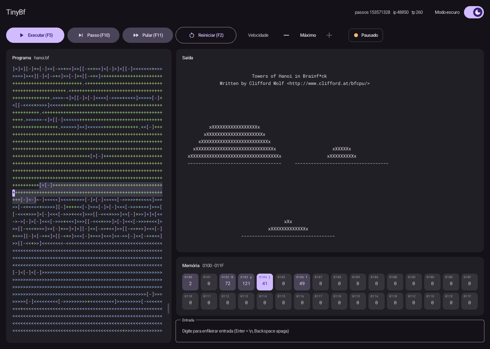
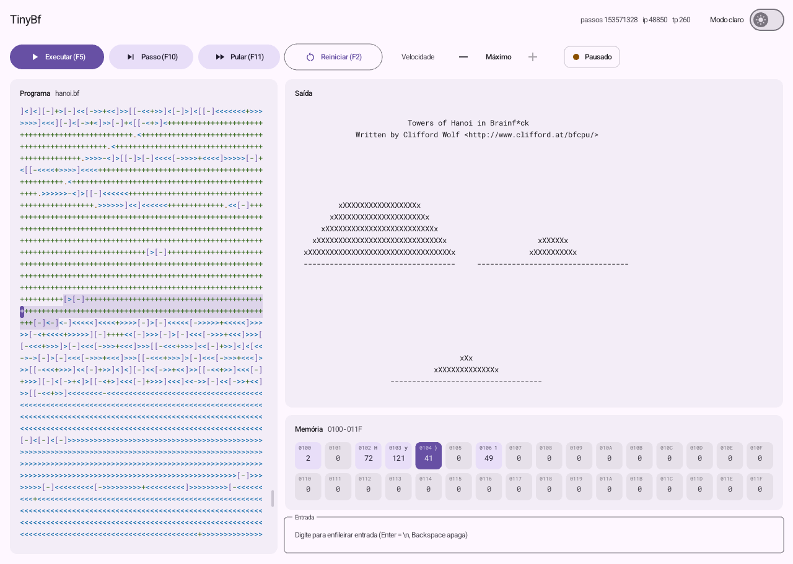

# TinyBf - A Tiny Brainfuck Interpreter

TinyBf é um interpretador de Brainfuck extremamente leve e simples, escrito em C.

## Licença

Este projeto é licenciado sob a licença MIT. Veja [LICENSE.md](LICENSE.md) para mais detalhes.

## Funcionalidades

* Interpretador de Brainfuck com suporte a:
+ Operações básicas (+, -, <, >, ., ,)
+ Loops ([, ])
+ Pilha de execução

## Compilação e Execução

Para compilar e executar o interpretador, siga os passos abaixo:

1. Clone o repositório com `git clone`
2. Execute `make` para compilar o projeto
3. Execute `make run ARGS=examples/hanoi.bf` para executar o interpretador no terminal
4. Execute `make run-gui ARGS=examples/hanoi.bf` para abrir a interface gráfica

A interface gráfica também pode ser aberta com `./bin/tbf --gui [ARQUIVO]` e aceita arquivos arrastados para a janela.

A interface segue o Material Design 3, usa as fontes Roboto e Roboto Mono com ícones Material Icons e tem um switch no canto superior direito para alternar entre os modos claro e escuro.

## Dependências

* GCC (GNU Compiler Collection) versão 9 ou superior
* Make versão 4 ou superior
* Git e bibliotecas de desenvolvimento do X11 e OpenGL (a raylib 5.5 é baixada e compilada em `thirdparty/` automaticamente)
* curl (as fontes Roboto, Roboto Mono e Material Icons são baixadas em `thirdparty/fonts/` automaticamente)

## Requisitos

* Sistema operacional Linux ou similar

## Contribuição

Contribuições são bem-vindas! Se você tiver alguma sugestão ou correção, sinta-se à vontade para abrir uma issue ou enviar um pull request.

## Comandos do Makefile

* `make build`: compila o projeto em `bin/tbf`
* `make run`: executa o interpretador no terminal com o arquivo passado em `ARGS`
* `make run-gui`: abre a interface gráfica com o arquivo passado em `ARGS`
* `make clean`: remove o arquivo executável

---

2025 - Marcel Guinhos de Menezes Feitosa